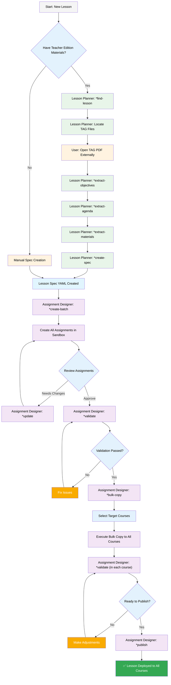
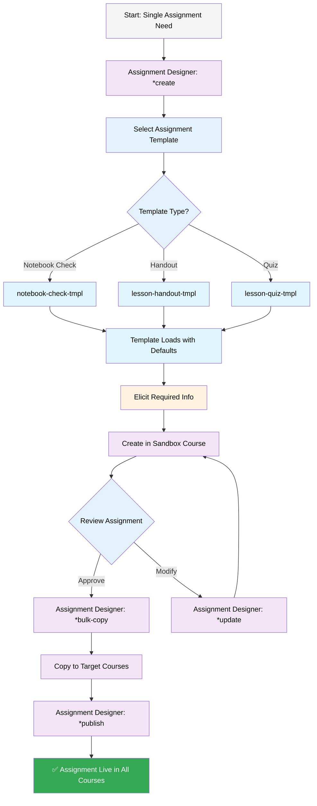
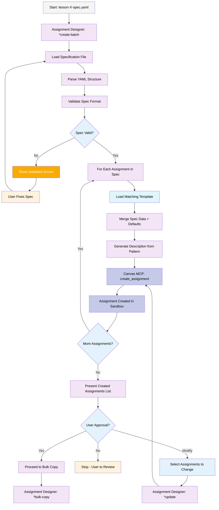
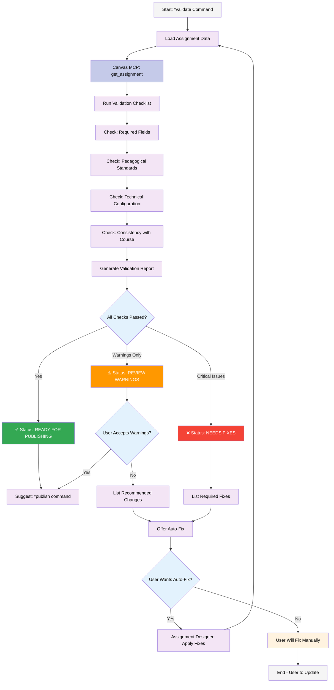
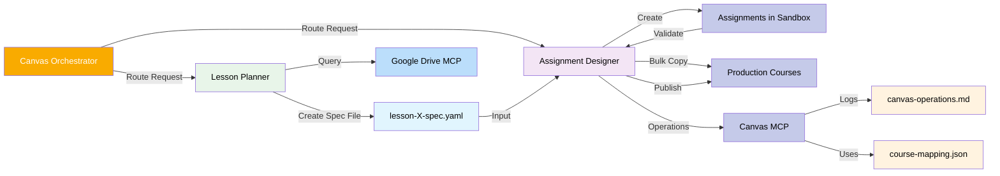
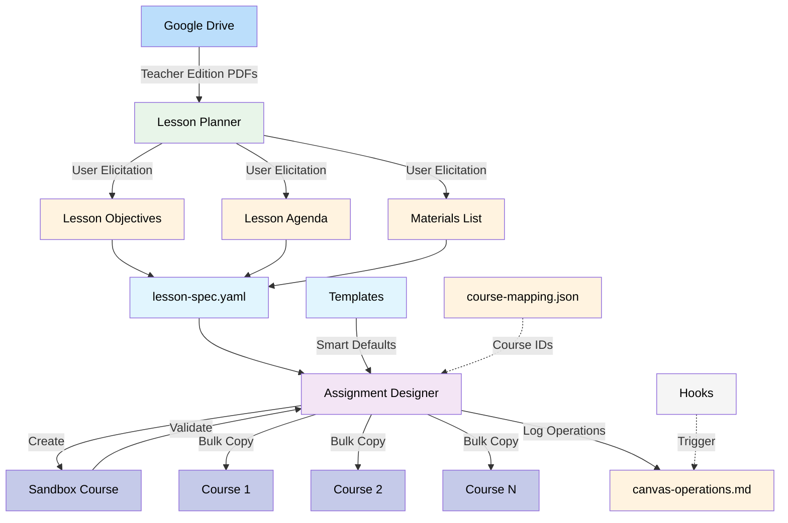

# Canvas Workflow System - Visual Workflows

This document provides mermaid diagrams for Canvas LMS workflows.

## Complete Lesson Deployment Workflow

This is the full workflow from lesson planning through assignment publication:

**Agent Key**:
- 🟢 Green: Lesson Planner (Sophia)
- 🟣 Purple: Assignment Designer (Maya)
- 🔵 Blue: Decision Points
- 🟠 Orange: User Actions
- 🟡 Yellow: Fix/Adjust Steps

---

## Quick Single Assignment Workflow

For creating a single assignment without full lesson planning:

---

## Lesson Planning Google Drive Integration

Semi-automated workflow showing file discovery and content elicitation:

```mermaid
graph TD
    A["Start: Plan Lesson X"] --> B["Lesson Planner: *find-lesson grade=8 unit=3 lesson=1"]
    B --> C["Google Drive MCP: search"]
    C --> D["Locate Grade 8 Folder"]
    D --> E["Google Drive MCP: folder_children"]
    E --> F["Find TAG & HOL Files"]
    F --> G["Google Drive MCP: file_metadata"]
    G --> H["Present File Info to User"]
    H --> I["User Opens TAG PDF Externally"]
    I --> J["Lesson Planner: *extract-objectives"]
    J --> K{"User Provides Objectives"}
    K --> L["Store Objectives"]
    L --> M["Lesson Planner: *extract-agenda"]
    M --> N{"User Provides Agenda"}
    N --> O["Store Agenda"]
    O --> P["Lesson Planner: *extract-materials"]
    P --> Q{"User Provides Materials"}
    Q --> R["Map to Assignment Templates"]
    R --> S["Lesson Planner: *create-spec"]
    S --> T["Generate lesson-X-spec.yaml"]
    T --> U["Validate Spec Structure"]
    U --> V["✅ Lesson Spec Ready"]
    V --> W["Handoff to Assignment Designer"]

    style A fill:#f5f5f5,color:#000
    style B fill:#e8f5e9,color:#000
    style C fill:#bbdefb,color:#000
    style D fill:#bbdefb,color:#000
    style E fill:#bbdefb,color:#000
    style F fill:#bbdefb,color:#000
    style G fill:#bbdefb,color:#000
    style H fill:#e8f5e9,color:#000
    style I fill:#fff3e0,color:#000
    style J fill:#e8f5e9,color:#000
    style K fill:#e3f2fd,color:#000
    style L fill:#e8f5e9,color:#000
    style M fill:#e8f5e9,color:#000
    style N fill:#e3f2fd,color:#000
    style O fill:#e8f5e9,color:#000
    style P fill:#e8f5e9,color:#000
    style Q fill:#e3f2fd,color:#000
    style R fill:#e8f5e9,color:#000
    style S fill:#e8f5e9,color:#000
    style T fill:#e1f5fe,color:#000
    style U fill:#e8f5e9,color:#000
    style V fill:#34a853,color:#fff
    style W fill:#f3e5f5,color:#000
```

**Process Key**:
- 🟢 Green: Lesson Planner Agent Actions
- 🔵 Light Blue: Google Drive MCP Calls
- 🔷 Blue: User Decision/Input Points
- 🟠 Orange: External User Actions
- 🟣 Purple: Handoff to Next Agent

---

## Batch Assignment Creation from Spec

Workflow for creating multiple assignments from a lesson specification:

**Process Key**:
- 🟣 Purple: Assignment Designer Actions
- 🔵 Blue Gradient: Canvas MCP Operations
- 🔵 Light Blue: Template Operations
- 🔷 Blue: Decision Points
- 🟡 Yellow: Error/Fix Steps

---

## Bulk Copy to Courses Workflow

Detailed workflow for copying assignments from sandbox to production courses:

```mermaid
graph TD
    A["Start: *bulk-copy Command"] --> B["List Sandbox Assignments"]
    B --> C["Filter Unpublished Only"]
    C --> D["Present Numbered List"]
    D --> E{"User Selection"}
    E -->|All| F["Load Course Mapping"]
    E -->|Select Specific| G["User Selects Assignments"]
    G --> F
    F --> H["Load course-mapping.json"]
    H --> I["Present Target Courses"]
    I --> J{"Select Courses"}
    J -->|All Courses| K["Confirm: X assignments → Y courses"]
    J -->|Select Specific| L["User Selects Courses"]
    L --> K
    K --> M{"User Confirms?"}
    M -->|No| N["Cancel Operation"]
    M -->|Yes| O["For Each Target Course"]
    O --> P["For Each Selected Assignment"]
    P --> Q["Canvas MCP: create_assignment"]
    Q --> R{"Success?"}
    R -->|Yes| S["Track Success"]
    R -->|No| T["Log Error, Continue"]
    S --> U{"More Assignments?"}
    T --> U
    U -->|Yes| P
    U -->|No| V{"More Courses?"}
    V -->|Yes| O
    V -->|No| W["Generate Results Summary"]
    W --> X["Show Success/Failure Counts"]
    X --> Y{"All Successful?"}
    Y -->|Yes| Z["✅ Bulk Copy Complete"]
    Y -->|Some Failed| AA["⚠️ Partial Success - Review Errors"]

    style A fill:#f5f5f5,color:#000
    style B fill:#f3e5f5,color:#000
    style C fill:#f3e5f5,color:#000
    style D fill:#f3e5f5,color:#000
    style E fill:#e3f2fd,color:#000
    style F fill:#f3e5f5,color:#000
    style G fill:#fff3e0,color:#000
    style H fill:#f3e5f5,color:#000
    style I fill:#f3e5f5,color:#000
    style J fill:#e3f2fd,color:#000
    style K fill:#e3f2fd,color:#000
    style L fill:#fff3e0,color:#000
    style M fill:#e3f2fd,color:#000
    style N fill:#f9ab00,color:#fff
    style O fill:#f3e5f5,color:#000
    style P fill:#f3e5f5,color:#000
    style Q fill:#c5cae9,color:#000
    style R fill:#e3f2fd,color:#000
    style S fill:#e8f5e9,color:#000
    style T fill:#ffccbc,color:#000
    style U fill:#e3f2fd,color:#000
    style V fill:#e3f2fd,color:#000
    style W fill:#f3e5f5,color:#000
    style X fill:#f3e5f5,color:#000
    style Y fill:#e3f2fd,color:#000
    style Z fill:#34a853,color:#fff
    style AA fill:#ff9800,color:#fff
```

---

## Assignment Validation Workflow

Quality gate before publishing:

---

## Agent Interaction Map

How the three main agents interact:

**Legend**:
- 🟡 Yellow: Orchestrator (Router)
- 🟢 Green: Lesson Planner (Sophia)
- 🟣 Purple: Assignment Designer (Maya)
- 🔵 Light Blue: Data/Config Files
- 🔷 Blue Gradient: MCP Servers
- 🟠 Orange: Log/Mapping Files

---

## System Overview - Data Flow

Complete system showing data flow from Google Drive to Canvas:

---

## Notes

All diagrams use mermaid syntax and can be viewed in:
- VSCode with Markdown Preview Mermaid Support extension
- GitHub markdown preview
- Any markdown editor with mermaid support

**Color Scheme**:
- 🟢 Green (`#e8f5e9`): Lesson Planner operations
- 🟣 Purple (`#f3e5f5`): Assignment Designer operations
- 🔵 Blue (`#e3f2fd`): Decision points
- 🔷 Light Blue (`#e1f5fe`): Data/specs/templates
- 🔵 Blue Gradient (`#c5cae9`): Canvas/MCP operations
- 🟠 Orange (`#fff3e0`): User actions
- 🟡 Yellow (`#f9ab00`): Orchestrator/warnings
- 🟢 Success (`#34a853`): Completion states
- 🔴 Error (`#f44336`): Critical issues
